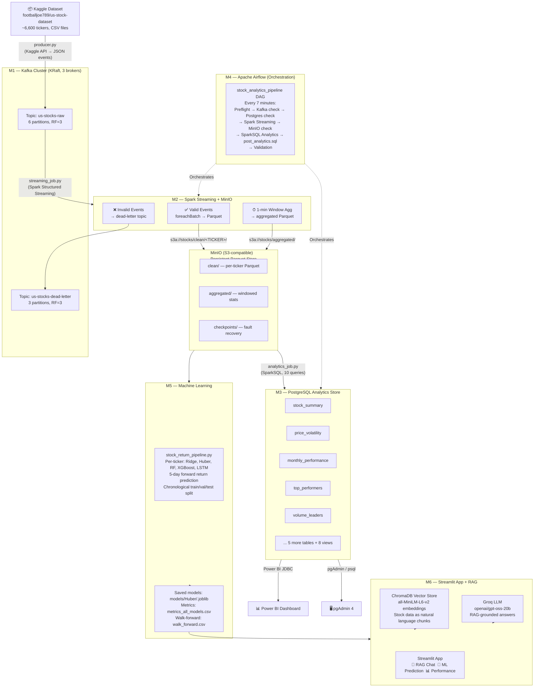

# 📈 Real-Time US Stocks Data Pipeline

<p align="center">
  
  
  
  
  
  
  
  
  
</p>

An end-to-end, production-grade streaming data engineering pipeline that ingests historical US stock market data from Kaggle, replays it as a real-time event stream through Apache Kafka, processes and validates events with Apache Spark Structured Streaming, stores clean Parquet files in MinIO (S3-compatible), runs SparkSQL analytics into PostgreSQL, orchestrates the full workflow via Apache Airflow, visualises results in Power BI, and surfaces predictions and RAG-powered Q&A through a Streamlit application — all containerised with Docker Compose.

---

## Table of Contents

- [Architecture](#architecture)
- [Project Objectives](#project-objectives)
- [Key Features](#key-features)
- [Technology Stack](#technology-stack)
- [Data Source](#data-source)
- [End-to-End Pipeline](#end-to-end-pipeline)
  - [M1 — Data Ingestion & Kafka](#m1--data-ingestion--kafka)
  - [M2 — Spark Structured Streaming](#m2--spark-structured-streaming)
  - [M3 — SparkSQL Analytics](#m3--sparksql-analytics)
  - [M4 — Airflow Orchestration](#m4--airflow-orchestration)
  - [M5 — Machine Learning](#m5--machine-learning)
  - [M6 — RAG Assistant & Streamlit App](#m6--rag-assistant--streamlit-app)
- [Service URLs](#service-urls)
- [Project Structure](#project-structure)
- [Prerequisites](#prerequisites)
- [Environment Configuration](#environment-configuration)
- [Installation](#installation)
- [Running the End-to-End Pipeline](#running-the-end-to-end-pipeline)
- [Verification & Testing](#verification--testing)
- [Monitoring & Observability](#monitoring--observability)
- [Data Quality](#data-quality)
- [Pipeline Design Decisions](#pipeline-design-decisions)
- [Scalability & Production Considerations](#scalability--production-considerations)
- [Troubleshooting](#troubleshooting)
- [Security](#security)
- [Future Improvements](#future-improvements)
- [Quick Start](#quick-start)

---

## Architecture

The pipeline is structured as six sequential milestones (M1–M6), each building on the output of the previous stage.



### Data Flow Summary

```
Kaggle (6,600+ CSVs)
  ↓  producer.py — Kaggle API → JSON events → Kafka
Apache Kafka (3-broker KRaft cluster)
  ↓  streaming_job.py — Spark Structured Streaming
MinIO (S3-compatible Parquet store)
  ↓  analytics_job.py — SparkSQL batch analytics
PostgreSQL (stocks_analytics DB — 10 tables, 8 views)
  ↓  Power BI / pgAdmin — dashboards & ad-hoc queries
  ↓  ML pipeline — per-ticker Huber/LSTM prediction models
  ↓  Streamlit + ChromaDB + Groq — RAG chat + predictions
```

---

## Project Objectives

| Objective | Implementation |
|---|---|
| Real-time event streaming of stock data | Kafka producer replays 6,600+ ticker CSVs as live JSON events at configurable throughput |
| Schema validation and dead-letter routing | Spark validates 14-field events; invalid rows go to `us-stocks-dead-letter` |
| Durable, fault-tolerant storage | MinIO Parquet files with Spark checkpoint-based recovery |
| Analytical insight at scale | 10 SparkSQL queries covering volatility, performance, dividends, breadth, signals |
| Full pipeline automation | Airflow DAG orchestrates the entire M1→M3 flow every 7 minutes |
| Predictive modeling | Per-ticker 5-day return prediction with leakage-safe feature engineering |
| AI-powered Q&A | RAG assistant grounded in a ChromaDB vector store of historical stock data |
| Reproducibility | Fully Dockerised — single `docker compose up` starts every service |

---

## Key Features

- **High-throughput Kafka producer** — streams up to 10,000 rows/second from 6,600+ Kaggle CSVs; handles 404s from missing tickers without retrying
- **3-broker KRaft Kafka cluster** — no ZooKeeper, replication factor 3, `min.insync.replicas=2`
- **Spark Structured Streaming** with three simultaneous sinks: clean Parquet, windowed aggregations, dead-letter Kafka topic
- **Idempotent Parquet merges** — `dropDuplicates(["event_id"])` ensures safe re-runs and Kafka replays
- **MinIO as HDFS replacement** — S3-compatible, persistent, browsable via web UI
- **10 SparkSQL analytics tables** — stock summary, price volatility, monthly/yearly performance, top performers, volume leaders, dividends, stochastic signals, market breadth, streaming windows
- **8 PostgreSQL views** — pre-built for Power BI consumption
- **Airflow DAG** — 7-minute cadence, 8 tasks, preflight environment checks, SLA monitoring
- **6 ML models per ticker** — Naive, Ridge, Huber, RandomForest, HistGradientBoosting, XGBoost, LSTM; auto-selects best by RMSE
- **RAG chat assistant** — ChromaDB + `all-MiniLM-L6-v2` + Groq LLM; ticker-aware retrieval
- **Streamlit app** — three tabs: RAG Chat, ML Prediction, ML Performance dashboard
- **Fully containerised** — Docker Compose with health checks and dependency ordering

---

## Technology Stack

| Layer | Technology | Version | Purpose |
|---|---|---|---|
| Data Source | Kaggle API / `kaggle` CLI | 1.6.14 | Download 6,600+ US stock CSVs |
| Message Queue | Apache Kafka (Confluent KRaft) | 7.6.1 | Event streaming, partitioning, dead-letter |
| Stream Processing | Apache Spark Structured Streaming | 3.5.7 | JSON parsing, validation, Parquet sink, windowing |
| Object Store | MinIO | latest (elestio) | S3-compatible Parquet + checkpoint storage |
| S3 Connector | Hadoop S3A + AWS SDK | 3.3.4 / 1.12.262 | Spark ↔ MinIO file-system bridge |
| Batch Analytics | SparkSQL | 3.5.7 | 10 analytical queries → PostgreSQL |
| Database | PostgreSQL | 16 | Analytics tables, views, indexes |
| Database UI | pgAdmin 4 | latest | Browser-based PostgreSQL management |
| Orchestration | Apache Airflow | 2.10.4 | DAG-based pipeline scheduling |
| BI Dashboard | Power BI Desktop | — | JDBC connection to PostgreSQL |
| ML Framework | scikit-learn, XGBoost, PyTorch | — | Per-ticker return prediction models |
| Vector Database | ChromaDB | 0.5.5 | Embedding store for RAG retrieval |
| Embeddings | Sentence Transformers (`all-MiniLM-L6-v2`) | 3.0.1 | Stock data → vector embeddings |
| LLM / RAG | Groq API (`openai/gpt-oss-20b`) | — | RAG-grounded answer generation |
| Application | Streamlit | 1.38.0 | Interactive UI for chat + predictions |
| Kafka UI | Kafbat Kafka UI | latest | Topic browsing, consumer lag monitoring |
| Infrastructure | Docker + Docker Compose | v24+ | Container orchestration |
| Language | Python | 3.11 | All pipeline scripts |

---

## Data Source

| Property | Value |
|---|---|
| **Dataset** | US Stock Dataset |
| **Provider** | Kaggle — `footballjoe789/us-stock-dataset` |
| **Direct link** | https://www.kaggle.com/datasets/footballjoe789/us-stock-dataset |
| **Format** | One CSV per ticker under `Data/StockHistory/<TICKER>.csv` |
| **Tickers** | ~6,200 available in the dataset (ticker universe in `Stock_List.csv` is ~6,600; some symbols are absent in the Kaggle dataset and return 404) |
| **Columns** | `Date`, `Open`, `High`, `Low`, `Close`, `Volume`, `Dividends`, `Stock Splits`, `STOCHk_14_3_3`, `STOCHd_14_3_3` |
| **Extra columns** | Many CSVs also contain `RSI_14`, `MACD`, `BBL`, `WILLR`, `OBV`, `AD` — these are ignored by the pipeline |
| **Date range** | Varies per ticker; most go back to 1980s–1990s |
| **Access** | Requires a free Kaggle account and API token |

**Why this dataset?** It provides decades of OHLCV history across thousands of US tickers in a consistent format, making it ideal for demonstrating a complete streaming + analytics + ML pipeline at realistic scale.

---

## End-to-End Pipeline

### M1 — Data Ingestion & Kafka

**Script:** `kafka/producer.py`  
**Validator:** `kafka/consumer.py`  
**Schema definition:** `kafka/topic_config.py`

The producer reads ticker symbols from `kafka/Stock_List.csv`, builds Kaggle file paths, downloads each CSV via the `kaggle` CLI (with a REST fallback), and streams every row as a JSON event to the `us-stocks-raw` Kafka topic. A background download thread and a main produce thread run concurrently, with an in-memory queue (max 5 files buffered) between them.

**Rate control:** `--rows-per-sec` controls throughput (default 10,000 rows/s in `docker-compose.yml`). A per-row sleep timer ensures accuracy.

**404 handling:** Tickers in `Stock_List.csv` that have no matching CSV in the Kaggle dataset are skipped immediately on a 404 — no retries, no backoff. This was a bug fix applied on 2026-09-09.

**Canonical event schema:**

```json
{
  "event_id": 1042,
  "ticker": "AAPL",
  "date": "2023-11-14",
  "open": 184.25,
  "high": 186.10,
  "low": 183.97,
  "close": 185.32,
  "volume": 52341200.0,
  "dividends": 0.0,
  "stock_splits": 0.0,
  "stochk_14_3_3": 72.41,
  "stochd_14_3_3": 68.15,
  "source_file": "Data/StockHistory/AAPL.csv",
  "produced_at": "2026-09-09T08:38:51Z"
}
```

**Kafka topic configuration:**

| Topic | Partitions | Replication | Retention | Use |
|---|---|---|---|---|
| `us-stocks-raw` | 6 | 3 | 7 days | Primary ingest |
| `us-stocks-dead-letter` | 3 | 3 | 30 days | Failed validation |

The M1 validation consumer (`consumer.py`) runs in a separate consumer group (`m1-validation-group`) and logs per-batch statistics, valid/invalid counts, and per-field error breakdowns. Spark's streaming job uses its own independent group (`spark-streaming-group`).

---

### M2 — Spark Structured Streaming

**Script:** `spark/streaming_job.py`  
**Container:** `stocks-spark` + `stocks-spark-worker`

Reads from `us-stocks-raw` (starting offset: `earliest`), applies the 14-field `StructType` schema via `from_json`, adds an `is_valid` flag based on null checks and range guards, and fans out to three simultaneous sinks:

**Sink 1 — Clean Parquet (MinIO):** `foreachBatch` trigger every 30 seconds. For each batch, collects distinct tickers, reads the existing per-ticker Parquet (if any), unions with new rows, deduplicates on `event_id`, sorts by `date`/`event_id`, and writes back with `mode("overwrite")` + `partitionBy("ticker")`. A single Spark job handles all tickers per batch.

```
s3a://stocks/clean/ticker=AAPL/part-00000-<uuid>.snappy.parquet
s3a://stocks/clean/ticker=MSFT/part-00000-<uuid>.snappy.parquet
...
```

**Sink 2 — Windowed Aggregations (MinIO):** 1-minute tumbling windows on `kafka_timestamp` with a 2-minute watermark. Writes `avg_close`, `total_volume`, `event_count` partitioned by `window_date`.

```
s3a://stocks/aggregated/window_date=2024-01-15/part-*.snappy.parquet
```

**Sink 3 — Dead-Letter (Kafka):** Invalid events are serialised back to JSON and published to `us-stocks-dead-letter`.

All three checkpoint locations live in MinIO (`s3a://stocks/checkpoints/`), enabling fault recovery across container restarts.

**Key bug fix (2026-09-11):** `merged.count()` was moved to _before_ the Parquet overwrite. The old code triggered a re-execution of the lazy plan against an already-deleted file, causing `SparkFileNotFoundException`.

---

### M3 — SparkSQL Analytics

**Script:** `spark/analytics_job.py` (authoritative version in `spark/` directory)  
**Post-processing:** `spark/post_analytics.sql`

A batch Spark job that reads all clean Parquet from MinIO with `spark.read.schema(CLEAN_SCHEMA).parquet(S3_CLEAN)` (explicit schema avoids Parquet footer reads and handles missing files gracefully), registers a temp view `stocks`, then runs 10 SparkSQL queries:

| # | Table | Key Metrics |
|---|---|---|
| 1 | `stock_summary` | `trading_days`, `avg_close`, `total_volume`, `avg_daily_range` |
| 2 | `price_volatility` | `coeff_variation_pct`, `all_time_high`, `win_rate_pct` |
| 3 | `monthly_performance` | `month_return_pct`, `avg_close`, `total_volume` per month |
| 4 | `yearly_performance` | `year_return_pct`, `avg_close`, `total_volume` per year |
| 5 | `top_performers` | `pct_change`, `direction` (GAINER/LOSER/FLAT), all-time |
| 6 | `volume_leaders` | `total_volume`, `avg_daily_volume`, `high_volume_days` |
| 7 | `dividend_analysis` | `total_dividends_paid`, `approx_dividend_yield_pct` |
| 8 | `stochastic_signals` | `overbought_k`, `oversold_k`, `overbought_rate_pct` |
| 9 | `daily_market_breadth` | `advancing_stocks`, `advance_decline_pct` per date |
| 10 | `streaming_window_summary` | 1-min window stats (skipped if no aggregated data) |

Results are written via JDBC (`mode=overwrite`). Because `mode=overwrite` drops and recreates tables (which would break views), `analytics_job.py` first drops all 8 views from `post_analytics.sql` via JDBC before writing, then `post_analytics.sql` recreates them.

**Post-analytics SQL** creates 17+ indexes and 8 views:

| View | Description |
|---|---|
| `v_top_gainers` | Top 50 all-time gainers |
| `v_top_losers` | Top 50 all-time losers |
| `v_high_volatility` | Stocks with CV > 50% |
| `v_most_traded` | Top 100 by volume |
| `v_dividend_champions` | Dividend stocks by payout |
| `v_overbought_stocks` | Frequently overbought stocks |
| `v_market_trend` | 30-day rolling advance/decline |
| `v_full_stock_profile` | Combined single-row summary per ticker |

**Bulk loader:** `PostgresSQL/bulk_load_to_postgres.py` loads the full raw Kaggle dataset into `stocks_raw` — a separate flat table with one row per ticker per trading day, used for historical Power BI dashboards independently of the streaming pipeline.

---

### M4 — Airflow Orchestration

**DAG file:** `dags/stock_pipeline_dag.py`  
**DAG ID:** `stock_analytics_pipeline`  
**Schedule:** every 7 minutes (`schedule=timedelta(minutes=7)`)  
**Max active runs:** 1

The DAG orchestrates the full M1→M3 pipeline in a single run by exec-ing into already-running Docker containers (Docker-out-of-Docker via `/var/run/docker.sock`):

```
check_setup_preflight
  ├── check_kafka_health ──┐
  └── check_postgres_health ┘
             ↓
    run_spark_streaming_job   ← bounded by timeout (180s default)
             ↓
      check_minio_data         ← fails DAG if 0 objects in clean/
             ↓
     spark_analytics_job
             ↓
   load_post_analytics_sql
             ↓
       validate_data           ← row-count sanity check on all 9 tables
```

The `run_spark_streaming_job` task wraps `streaming_job.py` in a `timeout 180s` call. Exit codes 124 and 143 (timeout-induced SIGTERM) are treated as success — this is the expected way the bounded batch run ends. The SLA is set to 11 minutes.

**Design rationale:** exec-ing into `stocks-spark` reuses its pre-built JAR set, volume mounts, and environment variables without duplicating Spark configuration in Airflow.

---

### M5 — Machine Learning

**Script:** `Machine Learning/stock_return_pipeline.py`  
**Streamlit module:** `Streamlit App/prediction.py`

For each ticker with ≥ 800 rows, the pipeline:

1. Builds leakage-safe 20-day feature windows from `return_1d` and `log_volume`
2. Predicts the **5-day forward return** `(price[t+5] - price[t]) / price[t]`
3. Applies a train-only `TrainOnlyScaler` (prevents future data leakage)
4. Splits chronologically: 70% train / 15% validation / 15% test
5. Trains 6 models: Naive, Ridge, Huber, RandomForest, HistGradientBoosting, XGBoost, plus an LSTM with SmoothL1 loss
6. Selects the best model by mean test RMSE
7. Saves `<TICKER>.joblib` + `<TICKER>_meta.joblib` (includes scaler + target mean/std)
8. Outputs `metrics_all_models.csv`, `predictions_best_model.csv`, `quantile_summary.csv`, `leakage_audit.csv`, `walk_forward.csv`

The currently saved models are under `Streamlit App/models/Huber/` — Huber regression was the best-performing model across tickers.

**Walk-forward validation** uses an expanding window (5 folds) with Huber regression to give a realistic view of out-of-sample performance over time.

---

### M6 — RAG Assistant & Streamlit App

**App:** `Streamlit App/app.py`  
**RAG logic:** `Streamlit App/rag_chat.py`  
**Prediction:** `Streamlit App/prediction.py`  
**Vector DB build:** `RAG/src/build_vector_db.py`

The Streamlit application provides three tabs:

**💬 Chat / RAG** — the user asks any natural-language question about stock data. The system:
- Detects a ticker symbol from the question (regex + ignore-list)
- Embeds the query with `all-MiniLM-L6-v2`
- Queries ChromaDB with optional ticker filter (`where: {ticker: "AAPL"}`)
- Sends retrieved chunks + question to Groq (`openai/gpt-oss-20b`)
- Returns a grounded answer with sources

**🤖 ML Prediction** — loads the saved `.joblib` model for the selected ticker, fetches the last 20 trading days from ChromaDB, applies the training scaler, and predicts the 5-day return and implied future price.

**📊 ML Performance** — reads `metrics_all_models.csv` and `walk_forward.csv`, displays median RMSE/MAE/DirAcc across all tickers per model, per-ticker breakdowns, and walk-forward charts.

---

## Service URLs

All URLs are for local development. Start the full stack with `docker compose up -d` first.

| Service | URL | Credentials | Purpose |
|---|---|---|---|
| **Kafka UI** | http://localhost:8080 | None | Browse topics, messages, consumer lag |
| **Spark Master UI** | http://localhost:8081 | None | Running/completed Spark applications |
| **MinIO Console** | http://localhost:9001 | `minioadmin` / `minioadmin` | Browse Parquet files and checkpoints |
| **MinIO S3 API** | http://localhost:9000 | — | S3 endpoint used by Spark |
| **pgAdmin 4** | http://localhost:5050 | `admin@stocks.com` / `admin123` | PostgreSQL browser UI |
| **Airflow UI** | http://localhost:8082 | `admin` / `admin` (configurable in `.env`) | DAG management and task logs |
| **PostgreSQL** | `localhost:5432` | `stocks` / `stocks123` / db `stocks_analytics` | Direct JDBC connection |
| **Streamlit App** | http://localhost:8501 | None | RAG chat, ML prediction, performance |

---

## Project Structure

```text
.
├── kafka/                          # M1 — Kafka producer, consumer, topic config
│   ├── producer.py                 # Kaggle → Kafka streaming producer
│   ├── consumer.py                 # Validating micro-batch consumer (M1)
│   ├── topic_config.py             # Single source of truth: topic specs & event schema
│   └── Stock_List.csv              # Ticker universe (~6,600 symbols) mounted into container
│
├── spark/                          # M2 + M3 — Spark scripts, SQL, Docker image
│   ├── Dockerfile                  # Spark 3.5.7 + all pre-baked JARs (Kafka, S3A, Postgres JDBC)
│   ├── streaming_job.py            # Spark Structured Streaming: Kafka → MinIO
│   ├── analytics_job.py            # SparkSQL batch analytics: MinIO → PostgreSQL (authoritative)
│   ├── post_analytics.sql          # Indexes + 8 views (run after analytics_job.py)
│   ├── init_postgres.sql           # PostgreSQL init (run once on first container start)
│   ├── bulk_load.py / bl.py        # Bulk loader for raw Kaggle CSVs → stocks_raw table
│   └── test_kafka.py               # Kafka connectivity smoke test
│
├── SparkSQL/                       # M3 — alternative analytics_job.py (earlier version)
│   ├── analytics_job.py            # Earlier version of analytics job (kept for reference)
│   └── README.md
│
├── PostgresSQL/                    # PostgreSQL documentation + bulk loader
│   ├── bulk_load_to_postgres.py    # Robust bulk loader with ON CONFLICT + execute_values
│   ├── post_analytics.sql          # Copy of post_analytics.sql for PostgreSQL docs
│   ├── init_postgres.sql
│   └── README.md
│
├── dags/                           # M4 — Airflow DAG
│   └── stock_pipeline_dag.py       # Full pipeline orchestration: M1→M2→M3
│
├── airflow/                        # Airflow container configuration
│   ├── Dockerfile                  # Custom Airflow image (adds postgres provider + docker SDK)
│   ├── requirements-airflow.txt    # apache-airflow-providers-postgres + docker==7.1.0
│   ├── logs/                       # Airflow task logs (bind-mounted)
│   └── plugins/                    # Airflow plugins (bind-mounted)
│
├── Machine Learning/               # M5 — ML training pipeline
│   ├── stock_return_pipeline.py    # Full training pipeline: Ridge/Huber/RF/XGBoost/LSTM
│   └── README_M5_ML.md
│
├── Streamlit App/                  # M6 — Streamlit application
│   ├── app.py                      # Three-tab Streamlit UI
│   ├── rag_chat.py                 # RAG retrieval + Groq LLM response
│   ├── prediction.py               # Local inference from saved .joblib models
│   ├── requirements.txt
│   ├── chroma_db/                  # Pre-built ChromaDB vector database (not tracked in Git)
│   ├── models/Huber/               # Saved per-ticker models (<TICKER>.joblib + _meta.joblib)
│   ├── metrics_all_models.csv      # ML evaluation results
│   └── walk_forward.csv            # Walk-forward validation results
│
├── RAG/                            # M6 — standalone RAG module
│   ├── src/
│   │   ├── build_vector_db.py      # Build ChromaDB from stock CSVs + ML outputs
│   │   ├── rag_chat.py             # LangChain-based RAG (alternative implementation)
│   │   └── text_converter.py       # CSV rows → natural-language text for embedding
│   ├── app.py                      # Streamlit chat UI (standalone RAG version)
│   └── README.md
│
├── Power Bi/
│   └── Dashboard_stocks.pbix       # Power BI dashboard (Git LFS, ~340 MB)
│
├── backup_files/                   # Backup SQL files
│
├── docker-compose.yml              # Full stack: Kafka + Spark + MinIO + Postgres + Airflow
├── Dockerfile.python               # Producer + consumer image (Python 3.11-slim)
├── requirements.txt                # Python dependencies for producer/consumer/bulk loader
├── Stock_List.csv                  # Ticker universe (root copy; kafka/ copy is used at runtime)
├── env.example                     # Template for .env
├── .env                            # Local secrets — NEVER commit (in .gitignore)
├── .gitignore
├── .gitattributes                  # LFS tracking for .pbix
├── PIPELINE_QUICKSTART.md          # Step-by-step manual run guide (PowerShell)
└── README.md                       # This file
```

---

## Prerequisites

| Requirement | Version | Notes |
|---|---|---|
| Docker Desktop | v24+ | Allocate **at least 8 GB RAM** (Settings → Resources) |
| Docker Compose | Bundled with Docker Desktop | — |
| Kaggle account | — | Required for data download |
| Kaggle API token | — | Generate at https://www.kaggle.com/settings → API → Create New Token |
| Groq API key | — | Required for the RAG Streamlit app; free tier at https://console.groq.com/keys |
| Python | 3.10 / 3.11 / 3.12 | Only for running scripts outside Docker |
| Git LFS | — | Required to clone the `.pbix` file (`git lfs install` before cloning) |

**Host ports that must be free:**

`5050` (pgAdmin), `5432` (PostgreSQL), `7077` (Spark), `8080` (Kafka UI), `8081` (Spark UI), `8082` (Airflow), `9000` (MinIO API), `9001` (MinIO console), `9092`, `9093`, `9094` (Kafka brokers)

---

## Environment Configuration

Copy `env.example` to `.env` in the repository root and fill in your values:

```bash
cp env.example .env
```

```env
# ── Kaggle (REQUIRED — pipeline will not start without these) ──────────────
KAGGLE_USERNAME=your_kaggle_username
KAGGLE_KEY=your_kaggle_api_key

# ── Kafka ─────────────────────────────────────────────────────────────────────
KAFKA_BOOTSTRAP=localhost:9092,localhost:9093,localhost:9094
KAFKA_TOPIC=us-stocks-raw
KAFKA_DLT_TOPIC=us-stocks-dead-letter
KAFKA_GROUP_ID=m1-validation-group

# ── MinIO ─────────────────────────────────────────────────────────────────────
MINIO_ACCESS_KEY=minioadmin
MINIO_SECRET_KEY=minioadmin
MINIO_BUCKET=stocks

# ── PostgreSQL ────────────────────────────────────────────────────────────────
POSTGRES_DB=stocks_analytics
POSTGRES_USER=stocks
POSTGRES_PASSWORD=stocks123

# ── pgAdmin ───────────────────────────────────────────────────────────────────
PGADMIN_DEFAULT_EMAIL=admin@stocks.com
PGADMIN_DEFAULT_PASSWORD=admin123

# ── Airflow ───────────────────────────────────────────────────────────────────
# Generate with: python -c "import secrets; print(secrets.token_hex(32))"
AIRFLOW_SECRET_KEY=please-change-me-in-.env
AIRFLOW_ADMIN_USER=admin
AIRFLOW_ADMIN_PASSWORD=admin
```

> **Never commit `.env` to Git.** It is already listed in `.gitignore`. The `env.example` file is the only template that should be tracked.

For the Streamlit RAG app, create `Streamlit App/.env`:

```env
GROQ_API_KEY=your_groq_api_key
```

---

## Installation

### Step 1 — Clone the repository

```bash
git lfs install          # required for the .pbix file
git clone <your-repo-url>
cd <repo-directory>
```

### Step 2 — Configure environment

```bash
cp env.example .env
# Edit .env — add KAGGLE_USERNAME and KAGGLE_KEY at minimum
```

### Step 3 — Build Docker images

```bash
docker compose build
```

This builds two custom images:
- `Dockerfile.python` — Python 3.11 image for the producer and consumer
- `spark/Dockerfile` — Spark 3.5.7 with all required JARs pre-baked (Kafka connector, S3A, PostgreSQL JDBC)

And pulls:
- `confluentinc/cp-kafka:7.6.1` — 3 broker instances
- `elestio/minio:latest` — MinIO object store
- `postgres:16` — analytics database
- `dpage/pgadmin4:latest` — pgAdmin
- `apache/airflow:2.10.4-python3.11` — Airflow (custom image built on top)
- `ghcr.io/kafbat/kafka-ui:latest` — Kafka UI

### Step 4 — Start the full infrastructure

```bash
docker compose up -d
```

Wait approximately 60–90 seconds for KRaft leader election and all health checks to pass.

### Step 5 — Verify all services are healthy

```bash
docker compose ps
```

Expected output:

```
NAME                    STATUS          PORTS
kafka-1                 healthy         0.0.0.0:9092->9092/tcp
kafka-2                 healthy         0.0.0.0:9093->9093/tcp
kafka-3                 healthy         0.0.0.0:9094->9094/tcp
kafka-init              exited (0)
stocks-minio            healthy         0.0.0.0:9000-9001->9000-9001/tcp
stocks-minio-init       exited (0)
stocks-producer         running
stocks-consumer         running
kafka-ui                running         0.0.0.0:8080->8080/tcp
stocks-spark            running         0.0.0.0:7077->7077/tcp, 0.0.0.0:8081->8080/tcp
stocks-spark-worker     running
stocks-postgres         healthy         0.0.0.0:5432->5432/tcp
stocks-pgadmin          running         0.0.0.0:5050->80/tcp
airflow-webserver       healthy         0.0.0.0:8082->8080/tcp
airflow-scheduler       running
airflow-postgres        healthy
```

Both `kafka-init` and `stocks-minio-init` must show `exited (0)`. Any other exit code indicates a failure — check logs with `docker compose logs kafka-init`.

---

## Running the End-to-End Pipeline

The pipeline can be run manually (steps below) or automatically via Airflow after unpausing the DAG.

### Manual Execution Order

#### Step 1 — Verify data is flowing into Kafka

```bash
docker compose logs --tail=20 producer
```

Look for lines like `sent= 50/9876 ( 0.5%) total=50`. Also confirm at http://localhost:8080 → Topics → `us-stocks-raw` → Messages.

#### Step 2 — Run Spark Structured Streaming (M2)

```powershell
# Windows PowerShell
docker exec -it stocks-spark `
  /opt/spark/bin/spark-submit `
    --master spark://stocks-spark:7077 `
    --conf spark.jars.ivy=/tmp/.ivy2 `
    /opt/spark/work-dir/streaming_job.py
```

```bash
# Linux / macOS
docker exec -it stocks-spark \
  /opt/spark/bin/spark-submit \
    --master spark://stocks-spark:7077 \
    --conf spark.jars.ivy=/tmp/.ivy2 \
    /opt/spark/work-dir/streaming_job.py
```

Let this run for **at least 5 minutes** before proceeding. Verify Parquet files at http://localhost:9001 → Buckets → stocks → clean.

#### Step 3 — Run SparkSQL Analytics (M3)

```powershell
docker exec -it stocks-spark `
  /opt/spark/bin/spark-submit `
    --master local[4] `
    --conf spark.jars.ivy=/tmp/.ivy2 `
    --conf spark.hadoop.fs.s3a.impl=org.apache.hadoop.fs.s3a.S3AFileSystem `
    --conf "spark.hadoop.fs.s3a.endpoint=http://minio:9000" `
    --conf spark.hadoop.fs.s3a.path.style.access=true `
    --conf spark.hadoop.fs.s3a.access.key=minioadmin `
    --conf spark.hadoop.fs.s3a.secret.key=minioadmin `
    --conf spark.hadoop.fs.s3a.connection.ssl.enabled=false `
    /opt/spark/work-dir/analytics_job.py
```

Expected output ends with:
```
✓  Stock Summary         → table=stock_summary         rows=...
...
✓  Daily Market Breadth  → table=daily_market_breadth   rows=...
Analytics complete in ~40s
```

#### Step 4 — Apply indexes and views

```powershell
docker cp spark/post_analytics.sql stocks-postgres:/tmp/post_analytics.sql
docker exec -i stocks-postgres psql -U stocks -d stocks_analytics `
  -f /tmp/post_analytics.sql
```

#### Step 5 — Verify PostgreSQL output

```bash
docker exec -it stocks-postgres psql -U stocks -d stocks_analytics -c "
SELECT tablename, pg_size_pretty(pg_total_relation_size(tablename::text)) AS size
FROM pg_tables WHERE schemaname = 'public' ORDER BY pg_total_relation_size(tablename::text) DESC;"
```

#### Step 6 — (Optional) Bulk load raw Kaggle data

This loads every ticker CSV directly into `stocks_raw` for Power BI historical dashboards:

```bash
# Copy CSVs into the Spark container first
docker cp "path/to/StockHistory" stocks-spark:/tmp/StockHistory

# Install Python deps (once)
docker exec -it stocks-spark bash -c \
  "pip3 install --target=/tmp/pylibs psycopg2-binary pandas tqdm"

# Copy and run the bulk loader
docker cp "PostgresSQL/bulk_load_to_postgres.py" stocks-spark:/tmp/bulk_load_to_postgres.py
docker exec -it stocks-spark bash -c \
  "PYTHONPATH=/tmp/pylibs python3 /tmp/bulk_load_to_postgres.py \
   --data-dir /tmp/StockHistory --host postgres --port 5432 \
   --db stocks_analytics --user stocks --password stocks123 \
   --workers 4 --chunk 50000 --drop"
```

### Automated Execution via Airflow

1. Open http://localhost:8082 and log in
2. Find the `stock_analytics_pipeline` DAG and toggle it **on** (unpause)
3. The DAG runs every 7 minutes automatically
4. To trigger immediately: click the ▶️ button or run:

```bash
docker exec -it airflow-webserver airflow dags trigger stock_analytics_pipeline
```

### Running the Streamlit Application

```bash
cd "Streamlit App"
pip install -r requirements.txt
streamlit run app.py
```

The app opens at http://localhost:8501. Requires `chroma_db/` and `models/Huber/` to be present.

---

## Verification & Testing

### Kafka — confirm events are flowing

```bash
# Producer logs
docker compose logs --tail=30 producer

# Consumer validation stats
docker compose logs --tail=30 consumer

# Kafka UI — browse topics and messages
# http://localhost:8080 → Topics → us-stocks-raw
```

### MinIO — confirm Parquet files exist

```bash
docker exec -it stocks-minio-init bash -c \
  "mc alias set local http://minio:9000 minioadmin minioadmin && \
   mc ls --recursive local/stocks/clean/ | head -20"
```

### PostgreSQL — row counts for all tables

```bash
docker exec -it stocks-postgres psql -U stocks -d stocks_analytics -c "
SELECT 'stock_summary'            AS tbl, COUNT(*) AS rows FROM stock_summary       UNION ALL
SELECT 'price_volatility',                 COUNT(*) FROM price_volatility            UNION ALL
SELECT 'monthly_performance',              COUNT(*) FROM monthly_performance         UNION ALL
SELECT 'yearly_performance',               COUNT(*) FROM yearly_performance          UNION ALL
SELECT 'top_performers',                   COUNT(*) FROM top_performers              UNION ALL
SELECT 'volume_leaders',                   COUNT(*) FROM volume_leaders              UNION ALL
SELECT 'dividend_analysis',                COUNT(*) FROM dividend_analysis           UNION ALL
SELECT 'stochastic_signals',               COUNT(*) FROM stochastic_signals          UNION ALL
SELECT 'daily_market_breadth',             COUNT(*) FROM daily_market_breadth        UNION ALL
SELECT 'streaming_window_summary',         COUNT(*) FROM streaming_window_summary;"
```

### Airflow — check DAG status

```bash
docker exec -it airflow-webserver airflow dags list-runs -d stock_analytics_pipeline
```

### Spark — top performers sample

```bash
docker exec -it stocks-postgres psql -U stocks -d stocks_analytics -c \
  "SELECT ticker, pct_change, direction FROM top_performers ORDER BY pct_change DESC LIMIT 10;"
```

---

## Monitoring & Observability

| Tool | URL | What to Monitor |
|---|---|---|
| **Kafka UI** | http://localhost:8080 | Messages per topic, consumer lag per group, broker health |
| **Spark Master UI** | http://localhost:8081 | Active/completed applications, executor memory, task durations |
| **MinIO Console** | http://localhost:9001 | Bucket usage, object counts, storage metrics |
| **Airflow UI** | http://localhost:8082 | DAG run history, task duration, SLA misses, task logs |
| **pgAdmin** | http://localhost:5050 | Table sizes, query execution, index usage |

### Log commands

```bash
docker compose logs -f producer        # Kafka producer (download + produce rates)
docker compose logs -f consumer        # M1 validation batch stats
docker compose logs -f spark-worker    # Spark streaming output (batch IDs, row counts)
docker compose logs -f airflow-scheduler  # DAG scheduling events
docker compose logs kafka-init         # Topic creation (should end with "Topics ready. Done.")
docker compose logs minio-init         # Bucket creation (should end with "Bucket stocks is ready.")
```

---

## Data Quality

The following validation rules are enforced by `streaming_job.py` (Spark, real-time) and `consumer.py` (Python, M1):

| Field | Rule | Action on failure |
|---|---|---|
| `event_id` | Non-null | Route to dead-letter |
| `ticker` | Non-null | Route to dead-letter |
| `date` | Non-null, parseable as `YYYY-MM-DD` | Route to dead-letter |
| `open`, `high`, `low`, `close` | Non-null, `>= 0` | Route to dead-letter |
| `volume` | Non-null, `>= 0` | Route to dead-letter |
| `high` vs `low` | `high >= low` | Logged as invalid |
| `dividends`, `stock_splits` | Nullable — `0.0` on non-event days | Accepted |
| `stochk_14_3_3`, `stochd_14_3_3` | Nullable — `null` during indicator warm-up (~14 rows) | Accepted |
| Duplicate events | Deduplicated by `event_id` in Parquet merge | Silently removed |
| Timezone-aware dates in CSVs | Stripped with `.dt.tz_localize(None).dt.date` | Accepted |

Invalid events are published to `us-stocks-dead-letter` with a 30-day retention for investigation and reprocessing.

---

## Pipeline Design Decisions

**Why MinIO instead of HDFS?**  
MinIO provides an S3-compatible API that Spark's S3A connector understands natively. It eliminates the complexity of an HDFS cluster (NameNode, DataNode, journaling) while providing persistent, browsable storage via a web UI. All Spark checkpoints and Parquet files survive container restarts through a named Docker volume.

**Why `foreachBatch` instead of a native Parquet sink?**  
Spark's native Parquet streaming sink creates time-partitioned directories (`year=YYYY/month=MM/...`) which leads to thousands of small files across many partitions. `foreachBatch` with a merge-and-overwrite strategy produces one file per ticker, enabling efficient point queries and reducing metadata overhead.

**Why `event_id` for deduplication instead of composite keys?**  
The producer assigns monotonically increasing `event_id` values. Deduplicating on `event_id` is O(n) and avoids the complexity of composite key deduplication across `(ticker, date)`, where the same (ticker, date) can legitimately appear in multiple Parquet files before merging.

**Why KRaft (no ZooKeeper)?**  
KRaft reduces operational complexity: fewer containers, no ZooKeeper coordination overhead, and a simpler cluster configuration. Confluent's `cp-kafka:7.6.1` image supports KRaft natively.

**Why `mode=overwrite` in analytics_job.py?**  
The analytics job is designed to be idempotent — re-running it produces the same output as running it once. `mode=overwrite` guarantees a clean slate each run, avoiding stale rows from previous runs accumulating in analytics tables. The trade-off is that views must be dropped before each run (handled by `drop_views()` in `analytics_job.py`).

**Why exec-into-container instead of DockerOperator in Airflow?**  
`stocks-spark`, `stocks-minio`, and `stocks-postgres` are already running with all JARs, environment variables, and volume mounts configured. Exec-ing into these containers is equivalent to what a human would type at the terminal, and avoids duplicating Spark configuration (classpath, S3A JARs, environment) inside Airflow.

**Why per-ticker saved models in M5?**  
Financial time series have heterogeneous characteristics across tickers (volatility, trend, liquidity). A single global model would underfit most tickers. Training a separate model per ticker allows the pipeline to capture ticker-specific dynamics, and the saved `.joblib` artifacts enable instant inference in the Streamlit app without retraining.

---

## Scalability & Production Considerations

### Currently Implemented

- 3-broker Kafka cluster with replication factor 3 and `min.insync.replicas=2` — tolerates one broker failure
- Spark checkpointing in MinIO — streaming job recovers from any crash by resuming from the last committed Kafka offset
- `ON CONFLICT (ticker, date) DO NOTHING` in the bulk loader — safe concurrent inserts
- `maxOffsetsPerTrigger=50000` in the streaming job — prevents OOM on first run when replaying millions of historical rows
- `max_active_runs=1` in Airflow — prevents overlapping pipeline runs

### Future Production Improvements

- **Cloud deployment**: migrate MinIO → AWS S3 (S3A endpoint change only), Kafka → MSK, PostgreSQL → RDS/Aurora, Spark → EMR or Databricks
- **Schema registry**: add Confluent Schema Registry for Avro-based event schemas with versioning
- **Dead-letter reprocessing**: build an Airflow task to replay `us-stocks-dead-letter` after data quality fixes
- **Secrets management**: replace `.env` file with HashiCorp Vault or AWS Secrets Manager
- **Data partitioning at scale**: partition PostgreSQL tables by date ranges for larger datasets
- **CI/CD**: add GitHub Actions workflows for linting, unit tests, Docker image builds
- **Monitoring**: add Prometheus + Grafana for Kafka consumer lag alerts and Spark executor metrics
- **Data retention policies**: implement Parquet file compaction and archival for old MinIO data
- **Horizontal Spark scaling**: add more `spark-worker` replicas; configure dynamic resource allocation

---

## Troubleshooting

| Problem | Fix |
|---|---|
| Brokers not healthy after `docker compose up` | KRaft election takes up to 90s on first boot. Wait and re-run `docker compose ps`. |
| `kafka-init` exited with non-zero code | Run `docker compose logs kafka-init`. Last line must be `Topics ready. Done.` |
| Producer Kaggle auth error | Verify `KAGGLE_USERNAME` and `KAGGLE_KEY` in `.env`. Test: `kaggle datasets files footballjoe789/us-stock-dataset` |
| Producer logs `not in dataset — skipping` for many tickers | Expected — some symbols in `Stock_List.csv` have no CSV in the Kaggle dataset. Not a bug. |
| `Cannot read clean data from MinIO` in analytics job | Run `streaming_job.py` first and wait ≥5 minutes for Parquet to be written. |
| `PSQLException: cannot drop table … other objects depend` | This is fixed in `spark/analytics_job.py` by calling `drop_views()` before writing. If you run `SparkSQL/analytics_job.py` (older version), use `spark/analytics_job.py` instead. |
| `NUM_COLUMNS_MISMATCH` on Spark union | Fixed in `spark/analytics_job.py` — uses `spark.read.schema(CLEAN_SCHEMA).parquet(S3_CLEAN)` instead of manual per-ticker union. |
| Views missing after analytics run | Run `post_analytics.sql` after every analytics job: `docker exec -i stocks-postgres psql -U stocks -d stocks_analytics -f /tmp/post_analytics.sql` |
| `stocks_raw` table missing | Run Step 6 (bulk loader) — this table is not created by the streaming pipeline. |
| Power BI can't connect | Install Npgsql `.msi` driver and **restart your PC** before opening Power BI. Use `localhost` not `postgres` as server. |
| pgAdmin can't reach postgres | Use host `postgres` (not `localhost`) in the pgAdmin server registration. |
| Airflow DAG not appearing | Check `docker compose logs airflow-scheduler` for import errors. |
| `check_minio_data` fails with "0 objects" | `streaming_job.py` window (`STREAMING_RUN_SECONDS=180`) was too short, or the producer isn't running. Raise `STREAMING_RUN_SECONDS` in `stock_pipeline_dag.py`. |
| Port already in use | Stop the conflicting service or change the host-side port in `docker-compose.yml`. |
| Spark OOM / worker restarting | Allocate ≥8 GB RAM to Docker: Docker Desktop → Settings → Resources → Memory. |
| `AttributeError: Can only use .dt accessor with datetimelike values` | Using old `bulk_load_to_postgres.py`. Replace with `PostgresSQL/bulk_load_to_postgres.py` which uses `utc=True` + `.dt.tz_localize(None).dt.date`. |
| Streamlit: `FileNotFoundError: Model not found` | The `.joblib` model for that ticker was not trained. Check `models/Huber/` for available tickers. |
| Streamlit: `ChromaDB directory not found` | Run `RAG/src/build_vector_db.py` to build the vector database first. |
| `SparkFileNotFoundException` in streaming job | Fixed (2026-09-11) — `merged.count()` now runs before `write.mode("overwrite")`. If you see this, ensure you are running the latest `spark/streaming_job.py`. |

---

## Security

- **Credentials**: all secrets are loaded from `.env` via `python-dotenv`. The `.env` file is listed in `.gitignore` and must never be committed.
- **Default credentials**: the defaults in `env.example` are for local development only. Change `AIRFLOW_SECRET_KEY`, `POSTGRES_PASSWORD`, `MINIO_ACCESS_KEY`, and `MINIO_SECRET_KEY` before exposing any service outside localhost.
- **Network exposure**: all services communicate on the internal `stocks-net` Docker bridge network. Only explicitly mapped ports are exposed on the host.
- **Kaggle API key**: stored in `.env`, injected into the producer container as environment variables. Never logged or written to disk inside the container.
- **Groq API key**: stored in `Streamlit App/.env`, loaded at runtime by the Streamlit app.
- **Database authentication**: PostgreSQL uses `md5` authentication. The `stocks` user has full access to `stocks_analytics` only.

---

## Future Improvements

- **Real-time data source**: replace the Kaggle replay with a live market data API (Alpaca, Polygon.io) for true real-time streaming
- **dbt for transformations**: replace raw SparkSQL with dbt models for versioned, tested SQL transformations
- **Great Expectations**: add automated data quality checks between pipeline stages
- **MLflow**: track ML experiments, model versions, and metrics centrally instead of CSV files
- **Feature store**: implement a feature store (Feast or Tecton) to share ML features between the training pipeline and the Streamlit inference app
- **Model retraining automation**: add an Airflow task to retrain models when new data arrives and performance degrades
- **Grafana dashboards**: add Prometheus exporters for Kafka, Spark, and PostgreSQL, with Grafana alerts for consumer lag and pipeline SLA misses
- **Cloud-native deployment**: migrate to Kubernetes (EKS/GKE) with Helm charts for each service component
- **Streaming analytics directly to dashboard**: connect Spark streaming output directly to a real-time Power BI streaming dataset

---

## Quick Start

For experienced developers who want to run the full pipeline quickly on a machine with Docker Desktop, 8 GB RAM allocated, and a Kaggle API token ready:

```bash
# 1. Clone and configure
git lfs install && git clone <repo-url> && cd <repo-dir>
cp env.example .env
# Edit .env — set KAGGLE_USERNAME and KAGGLE_KEY

# 2. Build and start everything
docker compose build && docker compose up -d

# 3. Wait ~90s for KRaft election, then verify
docker compose ps   # all services should be healthy / running

# 4. Run Spark Streaming (let it run for 5+ minutes in a separate terminal)
docker exec -it stocks-spark /opt/spark/bin/spark-submit \
  --master spark://stocks-spark:7077 --conf spark.jars.ivy=/tmp/.ivy2 \
  /opt/spark/work-dir/streaming_job.py

# 5. Run SparkSQL Analytics
docker exec -it stocks-spark /opt/spark/bin/spark-submit \
  --master local[4] --conf spark.jars.ivy=/tmp/.ivy2 \
  --conf spark.hadoop.fs.s3a.impl=org.apache.hadoop.fs.s3a.S3AFileSystem \
  --conf "spark.hadoop.fs.s3a.endpoint=http://minio:9000" \
  --conf spark.hadoop.fs.s3a.path.style.access=true \
  --conf spark.hadoop.fs.s3a.access.key=minioadmin \
  --conf spark.hadoop.fs.s3a.secret.key=minioadmin \
  --conf spark.hadoop.fs.s3a.connection.ssl.enabled=false \
  /opt/spark/work-dir/analytics_job.py

# 6. Apply indexes and views
docker cp spark/post_analytics.sql stocks-postgres:/tmp/post_analytics.sql
docker exec -i stocks-postgres psql -U stocks -d stocks_analytics -f /tmp/post_analytics.sql

# 7. Verify — check row counts in PostgreSQL
docker exec -it stocks-postgres psql -U stocks -d stocks_analytics \
  -c "SELECT tablename, pg_size_pretty(pg_total_relation_size(tablename::text)) AS size \
      FROM pg_tables WHERE schemaname='public' ORDER BY 2 DESC;"

# 8. Open the dashboards
# Kafka UI:    http://localhost:8080
# Spark UI:    http://localhost:8081
# MinIO:       http://localhost:9001  (minioadmin / minioadmin)
# pgAdmin:     http://localhost:5050  (admin@stocks.com / admin123)
# Airflow:     http://localhost:8082  (admin / admin)

# 9. (Optional) Start the Streamlit app
cd "Streamlit App" && pip install -r requirements.txt && streamlit run app.py
```

To hand the pipeline over to Airflow for automated runs:

```bash
docker exec -it airflow-webserver airflow dags unpause stock_analytics_pipeline
```

---

## Data Flow Summary

```
Kaggle Dataset (footballjoe789/us-stock-dataset)
  ~6,200 CSVs, decades of OHLCV + stochastic indicators
           ↓
     producer.py (Python)
  Kaggle API → JSON events → Kafka (10,000 rows/s)
           ↓
    Apache Kafka (3-broker KRaft)
  Topic: us-stocks-raw (6 partitions, RF=3)
           ↓
   streaming_job.py (Spark Structured Streaming)
  Validate → Clean Parquet (per-ticker) + Windowed Agg → MinIO
  Invalid events → us-stocks-dead-letter
           ↓
         MinIO
  s3a://stocks/clean/<TICKER>/*.snappy.parquet
  s3a://stocks/aggregated/window_date=YYYY-MM-DD/*.parquet
           ↓
   analytics_job.py (SparkSQL batch)
  10 insight queries → PostgreSQL (stocks_analytics)
           ↓
       PostgreSQL 16
  10 analytics tables + 8 views + 17 indexes
           ↓
  ┌─────────────────────┬──────────────────────┐
  ↓                     ↓                      ↓
Power BI           ML Pipeline            RAG + Streamlit
JDBC dashboard     Huber/LSTM models      ChromaDB + Groq
historical charts  5-day predictions      natural language Q&A
```
